# Social E-commerce & Reels – Android Application

A modern Android app that merges the best of social media (vertical Reels browsing, TikTok-style) with full-featured e-commerce shopping and user profiles. Designed for a smooth, interactive experience with a polished UI and custom animations.

---

## Features

- **Reels Feed:** Vertical feed with video/image browsing, double-tap like animations, comments, and sound/music discovery.
- **Product Discovery:** Full shopping experience with product details, smart search & filters, and quick cart management.
- **Order Tracking:** Track order progress, view history, submit reviews with media, and get notifications.
- **User Profiles:** Personal profile, favorite items, recent activity, settings, notifications, and more.
- **Modern Design:** Built with Jetpack Compose, custom animations, responsive layouts, and intuitive navigation.
- **Media Upload & Playback:** Multi-image and video support throughout the app.
- **Authentication:** Secure login, registration, and profile management.
- **Seamless Navigation:** Fast transitions between all app sections.

---

## Tech Stack

- **Kotlin** & **Jetpack Compose**
- **MVVM architecture**
- **Room** (local storage)
- **ExoPlayer** (video playback)
- **Navigation Component**
- **Material Design 3**

---

## Screenshots

### Main Screens

| Reels Home                          | Reels Comments                         | Reels Cart                      |
|--------------------------------------|------------------------------------|-------------------------------------|
| 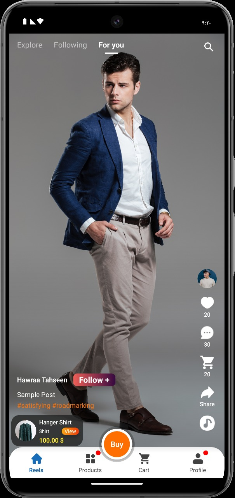      | 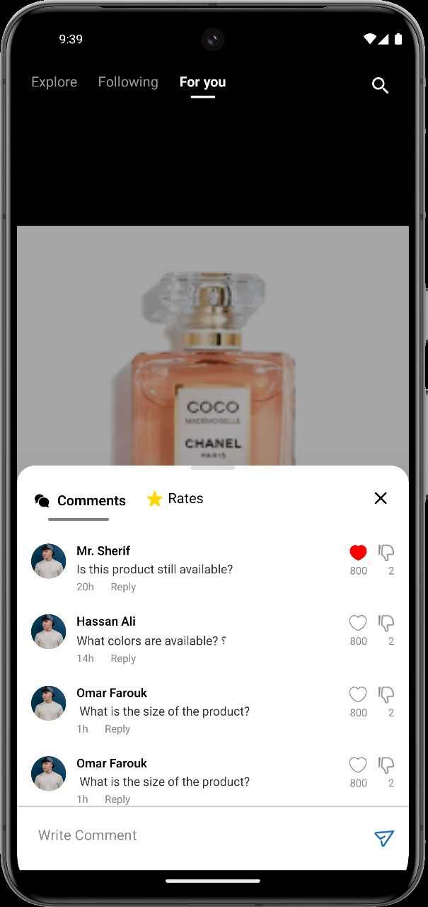    | 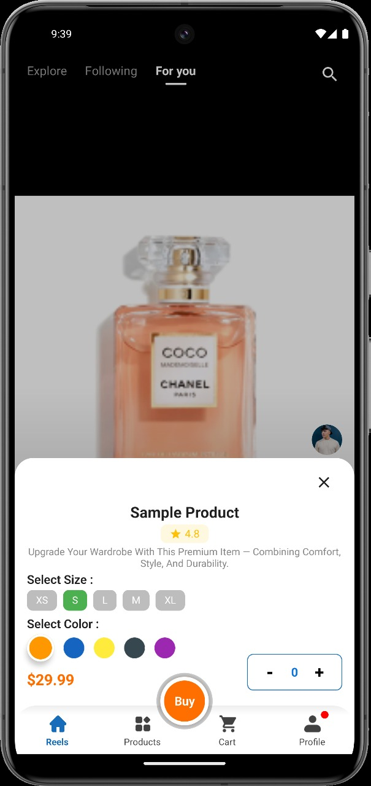  |

| Explore                              | Sound Page                         | Search Reels                        | Search User                         |
|--------------------------------------|------------------------------------|-------------------------------------|-------------------------------------|
| 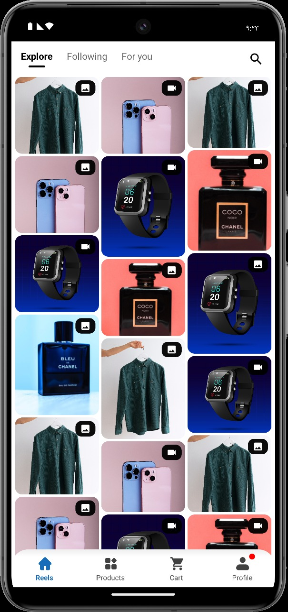         | 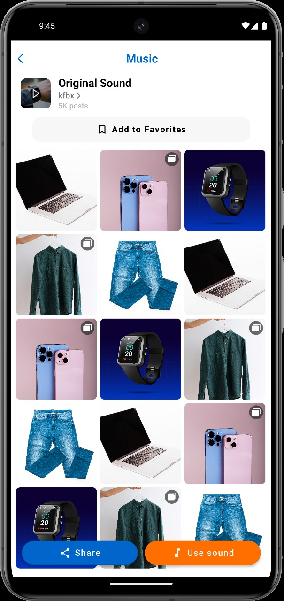         | 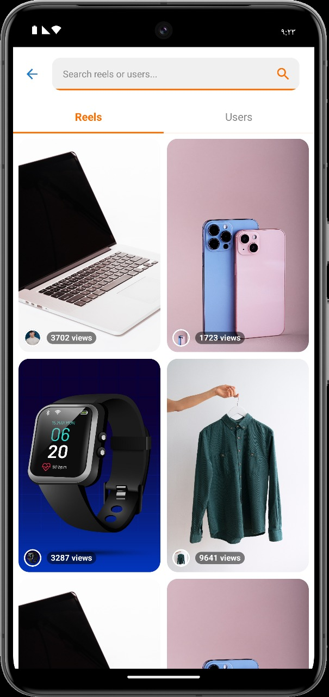   | 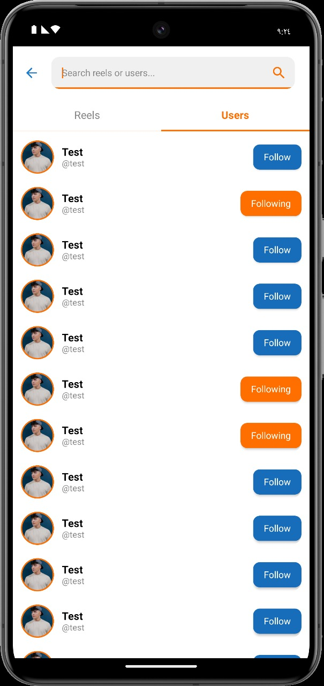   |

| Product Screen                       | All Products                       | Product Details                     |
|--------------------------------------|------------------------------------|-------------------------------------|
| 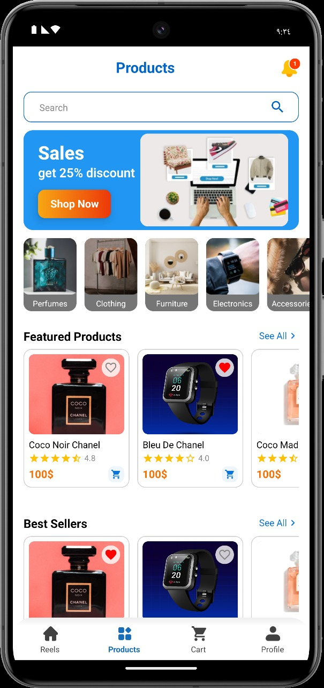  | 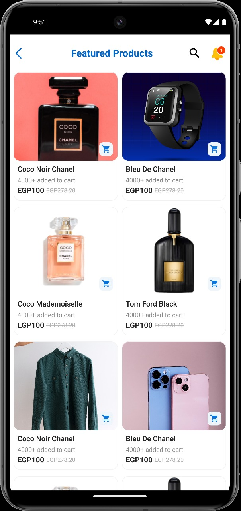  | 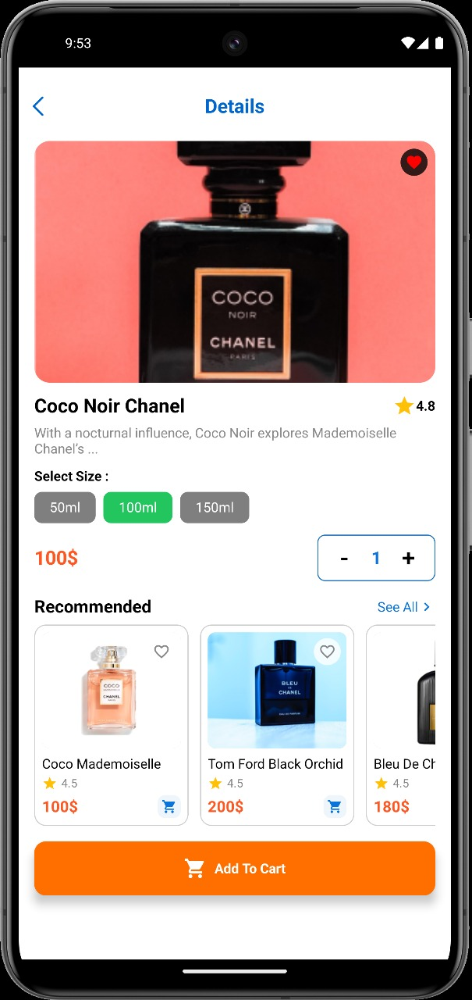|

| Product Search                       | Product Search Filter              | Cart                                | Payment                             |
|--------------------------------------|------------------------------------|-------------------------------------|-------------------------------------|
| 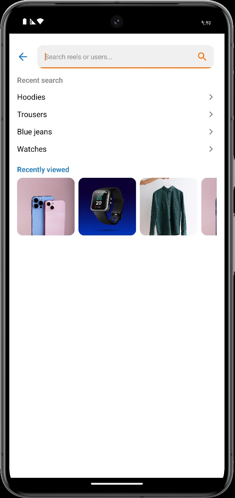  | 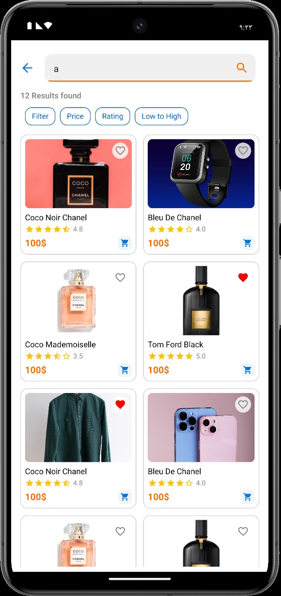 | 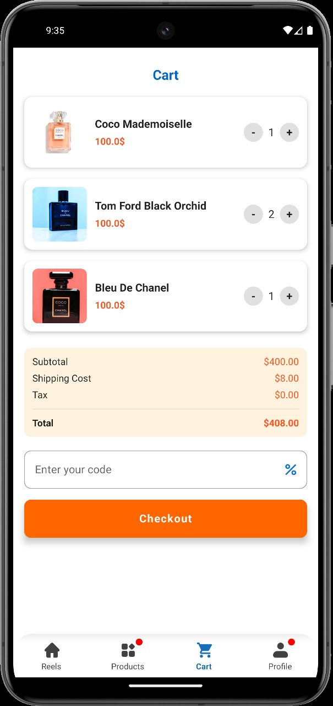  | 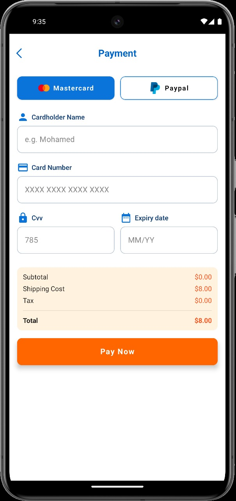        |

| Profile (Reels)                      | Profile (Products)                 | Add New Product                     |
|--------------------------------------|------------------------------------|-------------------------------------|
| 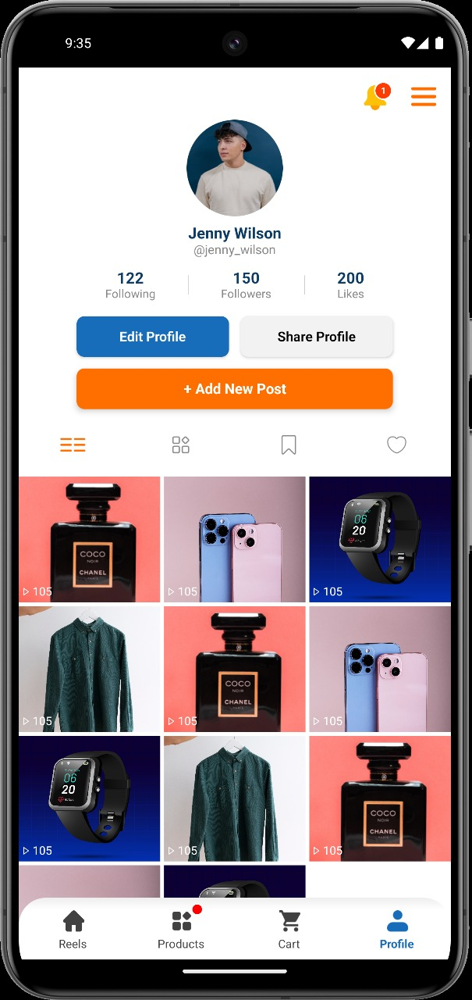   | 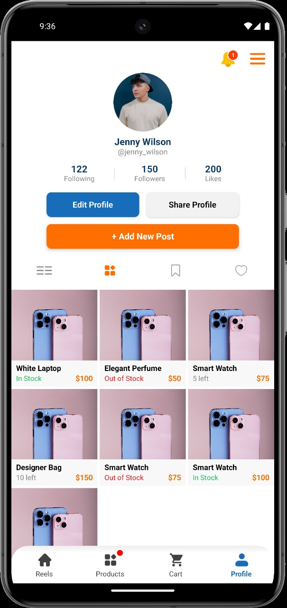 | 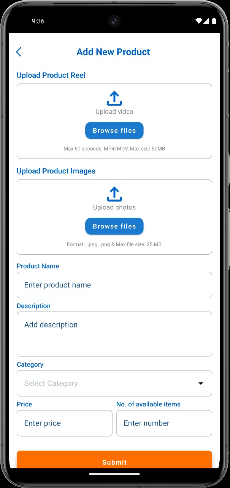|

| Orders History                       | Track Order                        | Notifications                       | Settings                            |
|--------------------------------------|------------------------------------|--------------------------------------|-------------------------------------|
| 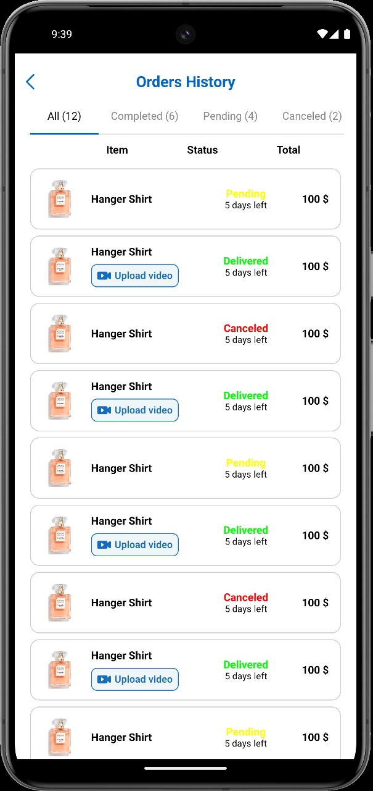  | 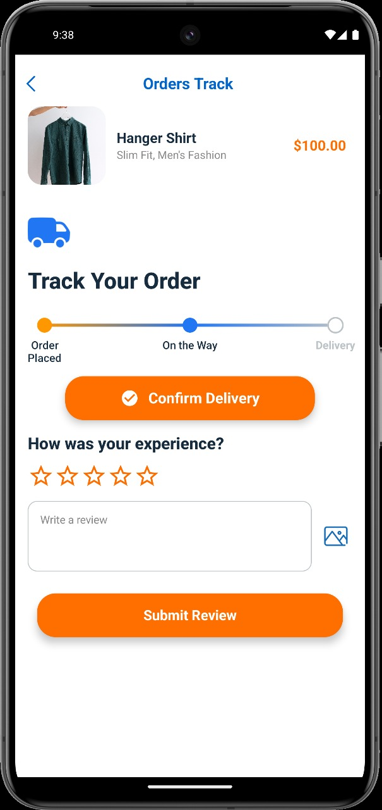   | 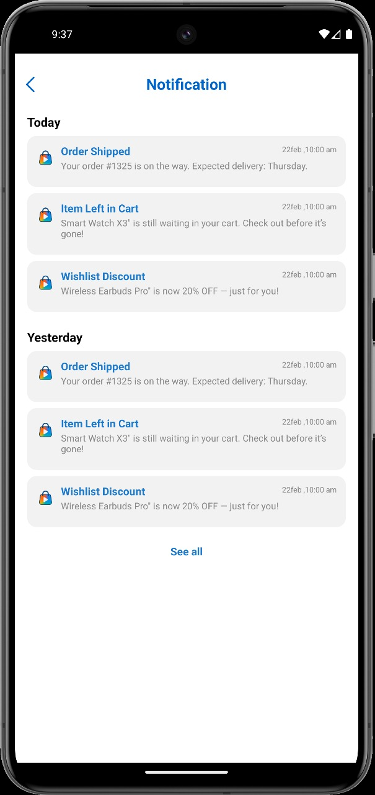   | 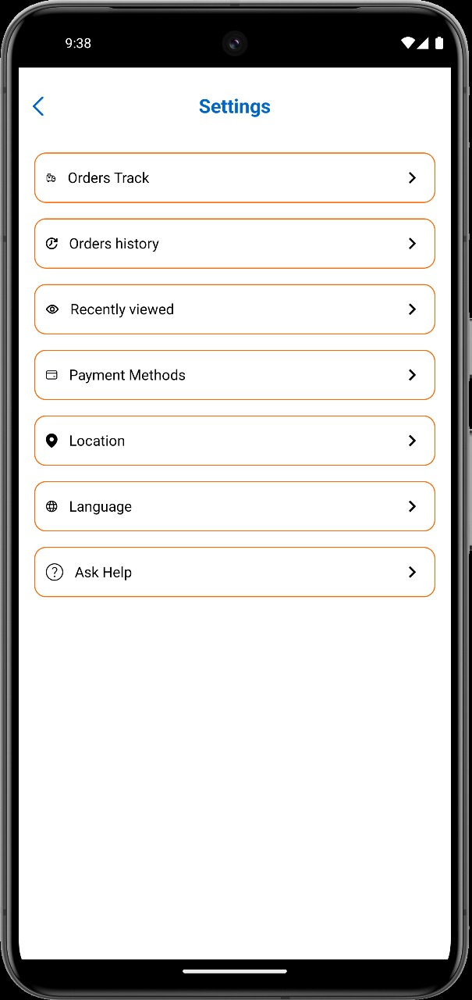       |

---

## Getting Started

1. **Clone the repository**  
   `git clone https://github.com/yourusername/yourrepo.git`
2. **Open in Android Studio** (latest recommended)
3. **Sync Gradle & build the project**
4. **Run on your device or emulator (API 24+)**

---

## License

This project is for personal and educational purposes.

---

*Designed & developed by Moamen Abdulrahman Youssef*
